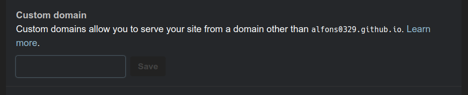

# 用Cloudflare DNS服務將Custom domain 用在自己GitHub部落格，並加上HTTPS

## 先備
* GitHub account
* 已經買好的Domain name（在此以 Gandi網域服務為例）
* Cloudflare account

## Github 設定 CNAME(要先辦好github page，不知道如何設定的可以自行Google一下)

點 Settings > Custom domain > 可以在裡面打上自己喜歡的 domain name
而當瀏覽github page 就會換連到自己自訂的網址而非github page

## 打入自己的網域

連到 Cloudflare 創帳號（很簡單，只要帳號密碼不用太多雜項資料）後，點 + Add site > Add your site 
即可打入你想要的網域囉

