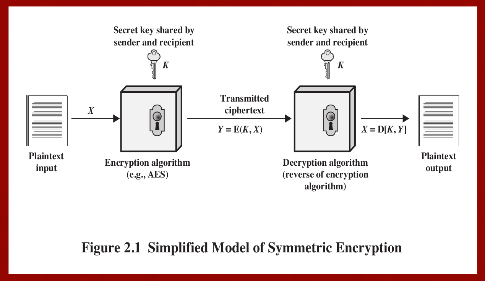
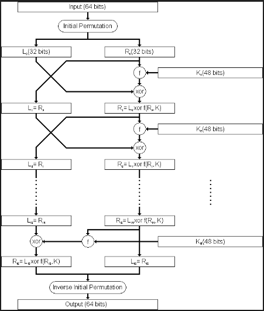
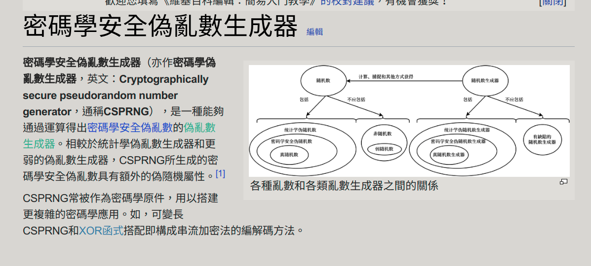
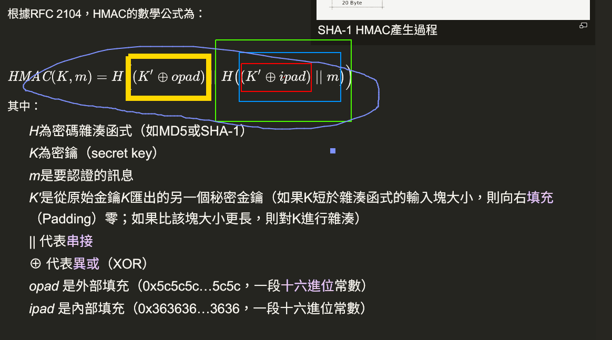
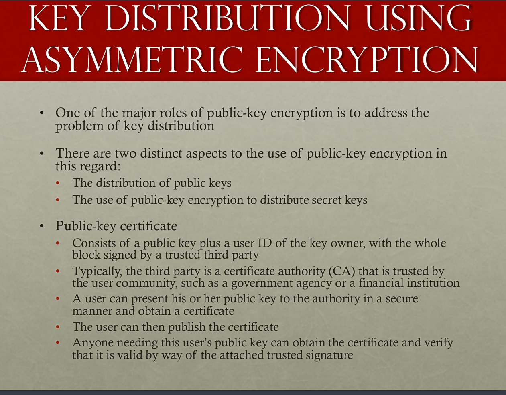

# Network Security
Spring 2018 <br />
Lecturer: Shiuhpyng Shieh <br />
## Ch1. Introduction.

## Ch2. Symmetric Encryption and Message Confidentiality

### Concept correction here:
* Assymetric encryption is not necessarily and absolutely better than the symmetric encryption, they can work with each other.

### Common type of the cryptanalysis

#### Brute force attack
* On avg, half of the keys have to be tested.
#### Ciphertext only attack
* Known the encryption algorithm
* Want to collect all the ciphtertext to find out the plaintext or ultimately, find out what the key is.
#### Known plaintext attack
* Use the known plaintext and the correspond ciphertext which encrypted by the encryption algorithm and ultimately find out what the key is.   

#### Chosen plaintext attack
* Use the dedicatedly and carefully crafted plaintext, figuring out the characteristics about the algorithm and ultimately find out what the key is.
##### Difference b/w known plaintext and chosen ciphertext
[See here](https://crypto.stackexchange.com/questions/2846/what-is-the-difference-between-known-plaintext-attack-and-chosen-plaintext-attac)

#### Chosen ciphertext attack
* As we've done in the course project 1, we use the dedicatedly and carefully crafted plaintext, figuring out the characteristics about the algorithm and ultimately find out what the key is.

### Feistel cipher architecture
*
### Model of symmetric encryption
* Encrypt and decrypt with the same key, the key should be shared through a secure manner.

* security of symmetric encryption depends on the secrecy of the key, not the secrecy of the algorithm, which means we should
keep the secret key as safe as possible.

### RSA Encryption standard

* Asymmetric encryption standard.

This encryption standard mainly focus on prime factorisation
更多資訊可以參考[外星人的筆記]()
#### Course project1. Chosen cipher attack
* Will post report after the session of this homework ends.

### DES Encryption standard
* An encryption algorithm use round, permutation shift and XOR operation to generate the ciphertext.
* Divide the plaintext into 64-bit-long in size for each if the block, and use the same length key for encryption(actually the key is not in the same length since there are 8 bits used for the parity-checking during the encryption)

[Image src](https://www.youtube.com/watch?v=Sy0sXa73PZA)
[DES Briefly introduction](https://chaomengyang.wordpress.com/2008/02/08/des-vs-3des-vs-aes/)
* Prone to brute force attack since the key space is too small to guarantee the safe area, so the safer 3-DES algorithm is used nowadays.
* 16rounds are needed for the encryption process
* The encryption and decryption are run under the same algorithm but they are in the reverse order with each other
* This is a model based on the [Fiestel model](https://zh.wikipedia.org/wiki/%E8%B4%B9%E6%96%AF%E5%A6%A5%E5%AF%86%E7%A0%81), namely for the encryption and decryption they use the same function but in the reversed order.

### From DES to 3DES
* DES is not so secure since the key is 56bits long, which is quite prone to BF cryptanalysis
* 3DES lengthens the key of DES (56 * 3 = 168), doing DES 3 times to make the encryption safer.
 <br />

* Please feel free to refer to my classmate's [note](https://hackmd.io/AhM957LCSuCMNzq0b5c1fw#Cryptography) for more information
* For encryption procedure:
P--E(K1)--A--D(K2)--B--E(K3)-->C <br />
C--D(K1)--B--E(K2)--A--D(K3)-->A <br />
Since the Fiestel architecture, the encryption and decryption method are just the reverse of each other.
* For decryption procedure:

### AES Encryption standard
* Make a better encryption of 3DES, namely evolve from 3DES for a stronger and faster encryption algorithm.
* AES is still the same as the DES in the category of block cipher encryption, but the block size of AES is 128 bits, doubled of the DES encryption.
* 10 Rounds of encryption again and again is needed.
  <br /> Image source from textbook
One grey-coloured box is the one "round" of the encryption in AES<br />
Each of the round we take the preceding round's output as the input of this round and do the encryption again, with the following 4 tasks to be done<br />
1.The **Substitution Bytes** is to use the non-linear transform to let the input transformed with a "Affine transformation", making the encryption robust and hard to be cracked<br />
2.The **Shift Rows(Bit transposition)** is shifting the data, to rearrange the text, for row i we shift i-1 times to the left.<br />

<br /> Image source from wikipedia <br />
3.The **Mix Columns** is a linear transform under the mod multiplication <br />
4.The **Add Round Key** is let the input XOR with the Key in the current state. (Rijndael key generator solution,which is a subkey in each round, which we can be seen from the image provided above that Key(16 bytes and expand to match for each round, divided into 10 subkeys for 10 operations in AES encryption))<br />
5.After the aforementioned four steps are done, go to the next encryption box. The operation is bytewise<br />

### The truly random number and pseudo random number
* Applications of the random number<br />
1.RSA pub-key generation and other pub-key algorithms.<br />
2.Session key for encryption in system such as Wi-Fi, e-mail<br />

<br /> Image source from wikipedia <br />

* The following 2 criteria are used to validate a sequence is random. <br />
1.Uniform distribution: The each element in the seed of random number must take the same proportion of being taken out.<br />
2.Independence: A sequence cannot be inferred from the other sequence, strictly and absolutely.<br />

### Block cipher vs Stream cipher

#### Stream cipher
* Change the encryption key from time to time, and each time the two part(sender-receiver) can generate the same random key s.t. they can encrypt and decrypt the same message.
The key of such encryption algorithm should have a extremely large period and as random as possible, o.w. it is crack-prone.<br />
In order to guard the BF attack, the longer key is preferred (However there is a trade-off b/w speed and security.)

As we can see the sender and receiver generate the same key for encryption and decryption.
Image source from textbook <br />
* RC4 Algorithm<br />
1.An algorithm with changeable key length encryption. <br />
2.SSL TLS WEP WPA use this encryption algorithm<br />
3.Easy to implement in both HW ans SW, but terminated in 2015 due to attack<br />

RC4 Encryption procedure <br />
1.Shuffle the key, make it randomised.
```cpp
for i from 0 to 255
     S[i] := i
 endfor
 j := 0
 for( i=0 ; i<256 ; i++)
     j := (j + S[i] + key[i mod keylength]) % 256 //randomly take the new j and swap, make a permutation
     swap values of S[i] and S[j]
 endfor
```
2.Get even more shuffle data, each time for a input byte, locate the i and j value by take the value in the key, XOR the inputByte with the key (since the reverse of XOR operation is itself, once we insert the ciphertext we'll get plaintext, and converse is true as well.)
```cpp
i := 0
j := 0
while GeneratingOutput:
    i := (i + 1) mod 256   //a
    j := (j + S[i]) mod 256 //b
    swap values of S[i] and S[j]  //c
    k := inputByte ^ S[(S[i] + S[j]) % 256] //XOR operation suit for this case. Reverse operation also works
    output K
endwhile
```

#### Block cipher
* Use the same key for the text, and divide the text into blocks, processing ONE BLOCK for each time. Processing procedure including shift position, substitute text to let the plaintext look similar, however, generating the
totally different ciphertext for cryptographically secure. <br />

* The AES(128 bits per block), DES(64 bits per block), 3DES(64 bits per block) are lie in this category.<br />

* 5 Block modes for the block cipher, defined by NIST USA. Intended to use for the symmetric cipher.  .<br />

1.Electronic Code Book where Encryption:  ciphertext[i] = code_book[plaintext[i]] just. Need a decryptor to do reversed tasks.<br />
2.Cipher Block Chaining, take the step i's ciphertext XOR with next step's plaintext and encrypt again. **If there is a bit error in the ciphertext, it will cause the decryption of plaintext i and plaintext i+1 error since they are chained together from step to step.**<br />
 <br />
3.Cipher FeedBack , only the encryptor is needed, 2 times of encryption is equivalent to decryption (Reason: ).<br />
 <br />
4.CounTeR , use the counter directly for the key of encryption. Can be processed parallelly since each block can be processed with its counter and independent with other blocks, random access is suitable as well. And use the same key for decryption due to the properties of XOR operation, once the ciphertext XOR key ---> plaintext is decrypted.<br />
The CTR mode is both HW and SW efficiency (parallelism are able to implemented in both CPU and compiler, OS ...etc). <br/>
What's more, the preprocessing can be done as well, even without the presence of the plaintext, we can still generate the required key and the next task is just let plaintext XOR key ---> ciphertext.

5.Output FeedBack similar too Cipher FeedBack, take the ciphertext from previous round and encrypt again<br />

[Useful reference site ,MUST READ!!!](http://morris821028.github.io/2015/03/21/security-block-ciphers/#%E5%8A%A0%E5%AF%86%E8%A8%AD%E8%A8%88%E5%9F%BA%E7%A4%8E%E5%8E%9F%E5%89%87)


## Ch3. Message Authencation and Public Key Cryptography
### Message Authencation Code (MAC)
* Using some hash value of the data and encrypt that value at the end of data for validation (see the image below)
* Clarify!!: MAC cannot perform the data encryption, it can only be used for data authentication and validation. <br />
* Such as parity checking is also a kind of message authentication. <br />
 <br />
<br /> Image source from wikipedia <br />

### Secure Hash Functions
 <br />
1.Collision and preimage-found resistant, making it unable to do the reverse of hash to forge the data. <br />

### Hash collision, strong vs weak
#### Strong
Given an arbitrary x there exists no x' with x' != x so that h(x) = h(x')
(更厲害，無法找到任取兩個產生相同雜湊數值)
#### Weak
There exist no given x, and will be infeasible to find x' with x != x' so that h(x) = h(x') (一個已知找無法找到另一個產生相同數值的雜湊)


### SHA Note, NOT AN Encryption standard!
* Term explanation (waiting for the answer from OAlienO) <br />
1.Message Digest Size: Message digest, MD(same as MD of MD5), of how much data amount we output, such as in the following SHA1 algorithm, we produce 160bits output (hex * 40 = 160). <br />

2.Message Size: Message amount that we can process in one time(Maxium input).<br />
3.Block Size: In block cipher, cut all the message into several blocks, in the block is how much message in a block to be processed<br />
4.Word Size: A size of a given state.<br />

* The following are the Message digest from the SHA512.


### Hashing, Why and How?
[hash youtube](https://www.youtube.com/watch?v=yXmNmckX4sI) <br />

* Hash aims for reduce the huge amount of data to the small amount.
* Can be used for verify and prevent the errors in the communication.
* Evan a small change in the original plaintext (such as only a bit), it will cause the totally different hash value, this
result is called Avalanche Effect. It ensures the security of hash algorithm.
* Hash has to be one-way and pre image, collision-resistant, otherwise , data will be forged.
**Hash is doomed to be broken or cracked, what matters is that we have to try out best to lengthen the time before being cracked**

### Hash-based message authentication code (HMAC)
**Watch out the color correspondence for better understanding the procedure**


### HMAC vs CMAC??
[so hmac vs cmac](CMAC.png)
* AS we can see from the picture for HMAC (aforementioned) and CMAC, although both of them use the key, but in

### Message encryption vs Message digestion(hashing), what is the difference?
[so encryption-vs-digest](https://stackoverflow.com/questions/3332662/encryption-vs-digest) <br />
[so how-is-an-md5-or-sha-x-hash-different-from-an-encryption](https://stackoverflow.com/questions/7574023/how-is-an-md5-or-sha-x-hash-different-from-an-encryption) <br />
[hash ,encryption and more](https://www.securityinnovationeurope.com/blog/page/whats-the-difference-between-hashing-and-encrypting) <br />
[so why-should-i-use-authenticated-encryption-instead-of-just-encryption](https://crypto.stackexchange.com/questions/12178/why-should-i-use-authenticated-encryption-instead-of-just-encryption) <br />

* Encryption: Really make the message secret, hard to be cracked and aims for security.
**key difference between encryption and hashing is that encrypted strings can be reversed back into their original decrypted form if you have the right key** ex. RSA AES DES ...
* Digestion (hashing): Digest the whole data, may be used for message authentication, producing an ID or FINGERPRINT of the input data.<br />
Hashing is great for usage in any instance where you want to **compare a value with a stored value, but can't store its plain representation for security reasons**. Other use cases could be checking the last few digits of a credit card match up with user input or comparing the hash of a file you have with the hash of it stored in a database to make sure that they're both the same. ex. MD5 SHA ...<br />
* Furthermore, if the digested data is encrypted, than it can be used for DIGITAL SIGNATURE.
1.For example in SHA family **能計算出一個數位訊息所對應到的，長度固定的字串（又稱訊息摘要）的演算法。且若輸入的訊息不同，它們對應到不同字串的機率很高。**
**OAlienO : SHA 不是加密因為他沒辦法解回原本的 input**

### Authenticated encryption (HMAC x CMAC x  CCM = CMAC + AES block cipher + CTR block mode)
* A term used to describe encryption systems that simultaneously protect confidentiality and authenticity of communications.
* Compared with traditional encryption, the authenticated encryption  additionally provides authenticity, while plain encryption provides only confidentiality.
* Usually more complicated than confidentiality-only or authenticity-only schemes.


### Public key cryptography
* Encrypt with public key: Want to send someone a message that only they(certain of groups,...etc) will be able to read, encrypt it with that person's public key.
* Encrypt with private key: Want to publish some information and guarantee that you're the author **(Reason is that the only person who encrypt with HIS PRIVATE KEY CAN ONLY BE THE ORGINAL AUTHOR, and everyone can use the public related to that private key to decrypt it)**, and that it hasn't been tampered with, then you encrypt it with your private key.(We can as well use the authenticated encryption to ensure the authenticity. Just like the aforementioned **Digital signature**)

[so What is we encrypt with private key??](https://stackoverflow.com/questions/16405240/encrypt-message-with-private-key)
### Private key vs Secret key, what is the difference?
* Private key: Use in asymmetric encryption.
* Secret key: Use in symmetric encryption, but it is quite hard for us (or say unsafe) to exchange secret key, so the Diffie Hellman key exchange algorithm is invented.

### Diffie Hellman key exchange
* A way to exchange the secret key via an unsafe path

[Math theory behind this algorithm](https://www.youtube.com/watch?v=Yjrfm_oRO0w)

* SSL, TLS, SFTP use it. Like the AES implemetation AES is symmetric encryption and a shared-secret-key exchange is needed for end-to-end data encryption.
* Both of end to end does not need to know each other (or cant break) his / her private key but share a same secret key to do secret data exchange.
* In this algorithm, we should choose a very big a, b and p s.t. Bob is unable so solve 'a' of Alice's secret and neither is Alice. o.w. Eve will hack into it and solve the shared secret key.
* Aside from the RSA, why use Diffie Hellman key exchange? <br />
Since the process of RSA is quite burdensome (numbers in it are extremely huge) so if we can back to the traditional symmetric encryption such as AES (just now we need a "secure pipe" under the "insecure pipe") to perform key exchange.
Than the end-to-end encryption can be achieved, what's more, this method is faster in which stream cipher are performed

### Man in the middle attack (MITM)
* The MITM forges the key of both side and deceives them, act as both fake Alice and Bob.

And the wikipedia analogy ,note: sequence different from the image<br />

The core idea about this is still the mathematical expression, for example for the secret key K1, since Darth intercepts the message, then he can forge the key with his secret key XD2 ,due to the following mathematical theory about modulo exponential.<br />

 <br />
So Alice is able to acquire the secret key via her own private key XA due to the upper math theory. **BUT SHE DOES NOT KNOW THAT YD2 ACTUALLY COMES FROM DARTH and DARTH now share the same key with Alice, so Alice thinks that Darth is Bob!! and the same is true for Bob!!** <br />
Originally the shared secret key should be lie on the mathematical expression like this<br />
 <br />
Rather than this <br />
 <br />

## Ch.4 Key Distribution and User Authentication

### Key distribution
* Used in the symmetric key crypto system to exchange keys from one end point to another.

### Kerberos and its components
* User password will not be transmitted but will be used as a shared secret for the authentication
* Centralised key distribution and authentication service b/w user and server(3rd party) that relies on symmetric encryption (No public key in it)
* Generates a symmetric secret key b/w two end points.
* Distributed system makes computing power better.
* During the key's lifetime (embedded in the message), the key can be used again and again.
* **Central idea relies on the trustworthy 3RD PARTY SERVER**
#### Authencation server (AS)
* Authenticate the user
#### Ticket granting server (TGS)
* Grant authenticated user permissions to act with the real server (SS, Service Server)
[wikipedia for detailed procedure](https://zh.wikipedia.org/wiki/Kerberos) <br />
[Detailed explanation video](https://www.youtube.com/watch?v=kp5d8Yv3-0c) <br />

### Timestamp portocal vs Challenge-Response Portocal

#### Timestamp portocal
* Record the timestamp of each data transaction.
* Prone to replay attack(a kind of MITM attack) if the clocks b/w the client and server is not synchronised
But how come will this happen?? <br />
If the system time is not synchronised, then suppose the end point EA is slower, then the MITM can intercept the message b/w two endpoint and resend the password again to hack and pretend to be the genuine user. What's more, since the time is slower in EA, then as the MITM intercepts data and resend, it does need some time to "RETRANSMIT" , but it is the slower time that allows the delay of retransmit time not be discovered if the time difference |T_received - T_send| < epsilon is not so strict.

#### Challenge-Response Portocal
* [Reference this video first!](https://www.youtube.com/watch?v=19CE1yeKzjU)
* The server and the receiver share a certain kind of "shared secret" that might be generated as the user registered in the system.
* Ensures the "Mutual Authentication"
* The procedure as follows:
Server sends a unique challenge value sc to the client<br />
Client sends a unique challenge value cc to the server<br />
Server computes sr = hash(cc + secret) and sends to the client<br />
Client computes cr = hash(sc + secret) and sends to the server<br />
Server calculates the expected value of cr and ensures the client responded correctly<br />
Client calculates the expected value of sr and ensures the server responded correctly
where<br />
sc is the server generated challenge<br />
cc is the client generated challenge<br />
cr is the client response<br />
sr is the server response<br />
* Since the secret is shared b/w the server and client, then is is able to verify the genuine of both server and client  
* A good challenge/response system will generate a new challenge for every transaction or session (and make sure that previous challenges are not reused!), so that session transcripts cannot be spliced together to create new fraudulent systems. (Maybe the challenge will be encrypted in both parties)

### Comparison b/w Kerberos v4 and Kerberos v5
[Reference here](http://www.differencebetween.info/difference-between-kerberos-v4-and-kerberos-v5)

* v4 is prone to MITM attack and v5 is not.
* Both of them provides mutual authentication

### What is mutual authentication and why we need it??
* 疑問：Mutual authentication 相較於 one way 他的好處是 可以同時驗證 伺服器方和使用者方嘛？？
就是伺服器能確認這個user 而且使用者也可以確認這個server
但是原本只有usr來確認server
多出這個server來確認usr 會有什麼優點呢？
解答：因為user和server都有可能被仿冒，因此需要雙重認證雙方。

* Both the server and client may be inpersonated, so we need to verify their real identification.

### Key distribution with asymmetric encryption (Public key certificate)
* The well known SSL use this method ,and the X.509 standard is used.
* Aimed to solve the problem that we want to verify the authentication of some authorities by the trusted certificated authority (CA)
* Step as follows

* Verify the signature that generated by CA to ensure the reality.

### What is the difference b/w the digital signature and public key authentication.
* From stackoverflow:
A digital signature is used to verify a message. It is basically an encrypted hash (encrypted by the private key of the sender) of the message. The recipient can check if the message was tampered with by hashing the received message and comparing this value with the decrypted signature (decrypted the signature with the public key from the sender).

To decrypt the signature, the corresponding public key is required. **A digital certificate is used to bind public keys to persons or other entities. If there were no certificates, the signature could be easily be forged, as the recipient could not check if the public key belongs to the sender.**

[Original discussion thread ](https://stackoverflow.com/questions/2882506/what-is-the-difference-between-digital-signature-and-digital-certificate) <br />
[Similar reference](http://support.unethost.com/knowledgebase.php?action=displayarticle&id=82) <br />

* The "Chain of Trust" SSL certificate, root certificate are all related to this topic **Actually the public key certification (certification distribution of authorize a genuine key) is the core concept of SSL/TLS portocal**
[Chain of Trust YouTube video](https://www.youtube.com/watch?v=heacxYUnFHA)
* Private key of root CA should be absolutely inaccessible.
* Once the "Chain of Trust" is successfully formed, an secure communication path can be formed (TLS using SSL certificate to do such things)
#### So a question comes to my mind, **What is the differenct b/w HTTPS,TLS and SSL?**
* Answer as follows:
1.TLS is just the new name (or say acronym) of SSL Namely, SSL protocol got to version 3.0; TLS 1.0 is "SSL 3.1". TLS versions currently defined include TLS 1.1 and 1.2. Each new version adds a few features and modifies some internal details. We sometimes say "SSL/TLS".<br />

2.HTTPS is the HTTP under the secured transmission protocol, i.e. HTTPS is HTTP-within-SSL/TLS. SSL (TLS) establishes a secured, bidirectional tunnel for arbitrary binary data between two hosts.<br />

### Why chain of trust??
* Even though the asymmetric (Public-key cryptography RSA) can ensure the secret communication, digital signature can ensure the correctness of content
, however, we are still not sure about whether the issuer of the digital certificate is the real "good guy" or the "forged guy."
[wikipedia ref](https://zh.wikipedia.org/wiki/%E4%BF%A1%E4%BB%BB%E9%8F%88)
### PKI, CA, Key...etc great explanation video
[Here](https://www.youtube.com/watch?v=i-rtxrEz_E8)

* A public key infrastructure (PKI) is a set of roles, policies, and procedures needed to create, manage, distribute, use, store, and revoke digital certificates and manage public-key encryption.

### When to revoke a user's certification??
* The user’s private key is assumed to be compromised(假定被洩漏出去了)
* The user is no longer certified by this CA; reasons for this
include subject’s name has changed, the certificate is
superseded, or the certificate was not issued in conformance
with the CA’s policies
* The CA’s certificate is assumed to be compromised

### The PKI architecture

[PKI YouTube video](https://www.youtube.com/watch?v=t0F7fe5Alwg)
* PKI is a framework that some vendor and use...etc should follow, and PKI associates a public key with a verified person/system.


## Ch.5 Cloud Security
### 802.1X, EAP(A framework)
* Used to control the access of user to the internet.
* provides a generic transport service for the
exchange of authentication information between a
client system and an authentication server.<br />
* The authentication server gives the instruction to the gate / authenticator such that it can give the client the internet resource he wants or not.
*  , auth methods through the EAP layer to reach the data link layer.
* Procedure as follows <br />
1.EAPOL(OL stands for data encapsulation)-Start, start the eap<br />
2.EAPOL(OL stands for data encapsulation)-EAP(REQ/IDENTITY) auth server wants to know the identity />
3.EAPOL(OL stands for data encapsulation)-EAP(RESPONSE/AUTH) five the clinet response<br />
4.EAPOL(OL stands for data encapsulation)-Logoff end the connection<br />
### Cloud Couputing
* Definition: Focus on what service cloud should have rather than a "how to" design architecture. a tool for
describing, discussing, and developing a system-specific
architecture using a common framework of reference.
* SaaS provides software such as google drive, PaaS manages the computing platform such as the web(middleware components), and IaaS provides the
hardware resources such as the network server and hosts...etc
* Roles in cloud computing. <br />
1.Carrier: Provide the transport b/w cloud services and consumers<br />
2.Auditor(稽查員): Assures that THE CP conforms to a certain cloud standards<br />
3.Broker(經紀人):Help the consumer to manage the cloud service when it is too complicated.<br />
### Data protection in the cloud
* Multi instance model: Am unique DBMS in each could subscriber(Risk distribution)
* Multi tenant model: Allows customers to share computing resources in a public or private cloud. Each tenant's data is isolated and remains invisible to other tenants.
**The rest of cloud computing will be read before the midterm 2**
## Ch.6 Transport-Level Security
### SSL Architecture
* SSL connection: each connection is transient , and associated with one session.
* SSL session: Association b/w the client and the server
[wikipedia](https://zh.wikipedia.org/wiki/%E5%82%B3%E8%BC%B8%E5%B1%A4%E5%AE%89%E5%85%A8%E6%80%A7%E5%8D%94%E5%AE%9A)
[NetAdmin](http://www.netadmin.com.tw/article_content.aspx?sn=1106140008)
### SSL Record Portocol
* Confidentiality with Handshake protocol to ensure that no one intercept in the pipeline, encrypt the data with secret key.
* Message integrity: With a shared secret key to ensure the MAC code
such that we may check whether the data has been modified or not.

### Pre master, master secret, private, shared / session key
* Pre master key: Allow for the uniform format of the master key.(Aim for the greater consistency)
* Master key is the agreement of both endpoint, master_secret = PRF(pre_master secret, "master secret"(aims for tag of current thing), Client ran + Server ran (or the Alice ran add up with the Bob ran))
[Check here](https://crypto.stackexchange.com/questions/27131/differences-between-the-terms-pre-master-secret-master-secret-private-key)

### Cryptographic Computations

### TLS, HTTPS = HTTP + SSL/TLS HTTP under a secure transport layer
* Port 443 will be used since it invokes the SSL
* The normal HTTP close we just need HTTP close, while the HTTPS we need the TLS which involves the underlying TCP connection.
* TLS requires the two entity of TCP in both client and server side.
* TLS should agree and exchange the closure alerts before closing connection.
### SSH
* Cryptographic network protocol
* 3different protocol: User authentication, Connection and Transport Layer Protocol
* Using the asymmetric encryption for user authentication(identify the private key of the user ti ensure the user is really him).
* Authentication method

* Package spec


### SSH Channel types
* Including Session (Remotely execute a command such like ssh afhwu0329@linux1.cs.nctu.edu.tw), X11 , Forwarded TCPIP(Remote Port Forwarding) Direct(Local PF)

### Port Forwarding
[SSHPF](https://gwokae.mewggle.com/wordpress/2010/08/%E5%88%A9%E7%94%A8ssh-tunnel%E9%80%A3%E7%B7%9A%E8%87%B3%E5%85%A7%E9%83%A8%E7%B6%B2%E8%B7%AF/)
* Useful features of SSH
* Insecure TCP -> SSH (Change the port from TCP to SSH)
* SSH force the traffic in the TCP change to the SSH layer.
* [Local vs Remote PF](https://blog.fundebug.com/2017/04/24/ssh-port-forwarding/)

* Local vs Remote ??
1.Local 自己連向更遠端的伺服器，從自己的角度看將自己的a埠經由ssh隧道連向（轉發導向）遠端remote server的b埠，藉由remote server傳到更遠端的faraway host<br />
2.Remote 當遠端伺服器想要連回來時，從自己的角度看將遠端的a埠經由ssh隧道連向（轉發導向）我這端local server的b埠，藉由local server連向我一旁的near host<br />

## Ch.7 Wireless Security
* Wireless devices are tend to have higher security risks than others since the following factors: Channel, Mobility, Resources, Accessibility.
* Common Wireless Network Threats: Accidental association, Malicious association, AD-HOC Networks, Identity theft(MAC Spoofing), MITM attack, DoS, Network injection.

### Protect against wireless eavesdropping
* Signal hiding(not so practical) and encryption(kind of practical).

### Protect the access point
* Main threat is the unauthorized access to the network.
* The 802.1X standard. provides the authentication for device wishing connecting to the LAN/WLAN.

### Mobile device security
* Major security issues are: Lack of physical
security controls, Use of untrusted
mobile devices, Use of untrusted
networks, Use of untrusted
content, Use of applications
created by unknown
parties, Interaction with
other systems, Use of location
services

### 802.11i Wireless protocol
* Controlled ports:PDU exchange within LAN b/w supplicant and other systems only if supplicant authorizes such an exchange
* Uncontrolled ports: Allows PDU exchange b/w supplicant and other RS regardless the authentication state.
* BSS, ESS? [Here](https://zh.wikipedia.org/wiki/%E6%97%A0%E7%BA%BF%E5%B1%80%E5%9F%9F%E7%BD%91)
### WEP, WPA, RSN
* WEP: Use RC4 for encryption, the level of security is unrelated with len of WEP key, 因為RC4是stream cipher的一種，同一個鑰匙絕不能使用二次，所以使用（雖然是用明文傳送的）IV的目的就是要避免重複；然而24位元的IV並沒有長到足以擔保在忙碌的網路上不會重複，而且IV的使用方式也使其可能遭受到關連式鑰匙攻擊, so change to WPA or WPA2 is the safer method。
* WPA: Fixed the vulnerability of WEP.

### 802.11i Fourway handshake auth.
* [Here](http://kezeodsnx.pixnet.net/blog/post/35561270-4-way-handshake)
* MIC is the message integrity code to ensure the integrity of the message.
* What is the purpose of ANonce and SNonce? As we can see from the 2017mid2 , they are used to generated the PTK for both the STA and AP, also the back SNonce serves like a challenge-response protocol to ensure the freshness and the alive of STA that there is no MITM attack and the same is true for AP.
* The GTK is used for decrypting the data of multicast and broadcast traffic, all of the STAs share the same GTK.
* GTK is distributed after the pairwise keys that already established (Use PK generated before to enctypt the GTK key )
* GTK Changed every time as device leaves network(yes TRANSIENT KEY!)
* TK with TKIP or CCMP are used for traffic key(encryption for data transfer phase)
provides message integrity and data confidentiality.
* HMAC-SHA1 are used to generated nonce, expand pairwise keys and to generate GTK, PTK(transient key)

## Ch8. EMAIL Security
### (Pretty Good Privacy)
* Provides a confidentiality and authentication service that
can be used for electronic mail and file storage applications
* PGP also provides the message authentication and the message integrity.
* Services
1.Digital signature: DSS, RSA , SHA<br />
2.Message encryption: CAST, IDEA, 3DES<br />
3.Compression: zip<br />
4.email compatibility: Base64 encryption <br />


#### PGP Authencation
* RSA ensures that only the mail sender signed with the digital sender, encrypt w his/her private key, can be decrypted with his/her public key, thus ensures the identity.
* SHA ensures that no one can generated the message with the same hash code
#### PGP Confidentiality
* 64bits CFB is used, using the block cipher , symmetric encryption.
* In PGP, each symmetric key is used only once.(The session key is bound with the message and transmitted.)
* Encrypt the sesion key with the receiver's public key.
#### PGP Compression
* PGP compresses the msg after signature but before encryption.
* If sign after the compression, then the version of compression will be constrained since different compression leads to different encoding thus different hash result even with the same source data.
#### PGP E-mail Compatibility
* Radix64(B64) encoding to convert them into printable ASCII chars.
* Append the CRC to protect the transmission error.

### S/MIME
* Security enhancement for the MIME
* Another standard besides PGP
#### MIME
* MIME improve from SMTP
* 5 Headers are defined, to fully describe the email, MIME-ver, content type, content-transfer encoding, content-ID, content description.

#### S/MIME  Functionality
* Enveloped data: encrypted content of any type **and
encrypted content encryption keys** for one or
more recipients.
* Signed data, message digest of content and digital signature with the private key of the signer. **Recipient without S/MIME compatibility are unable to view the data**
* Clear-signed data: Only the digital signature is encoded using
base64 **recipients without S/MIME
capability can view the message content,
although they cannot verify the signature**

#### Cryptographic algorithms used in S/MIME

* Smime secures the MIME with a signature ,encryption, or both
* Clear signing does not involve transforming the message to be signed.

#### S/MIME Certificate Processing
* Managers and/or users must configure each client with a list of trusted keys and with certificate revocation lists.
-->Local wil maintaining the certs needed
to verify incoming signatures and to encrypt outgoing messages.(MACV人的證書來檢驗別人的數位簽有以及要用自己的證書來為
* 自己的訊息加密，以及簽署。)


### DKIM
* cryptographically signing e-mail messages, permitting a signing domain t()o claim responsibility for a message in the mail stream
[YouTube](https://www.youtube.com/watch?v=yHv1OPcc-gw&t=134s)

## 2nd midterm note
### 2014mid2
* 客戶端在進行EAP拓展認證協議的時候是透過uncontrolled port和認證伺服器溝通，這個協議的標準制定在802.1X

* 在每一個SSL session和cinnection中 他們的參數會彼此互相分享，例如加密方法與秘鑰匙長度，session 和conenction他們的差別在於:SSL session與SSL connection是不同的概念。 SSL session指的是通過握手而產生的一些參數和加密秘鑰的集合；然而SSL connection是指利用某個session建立起來的活動的會話。換句話來說，connection是會話的進程，而session是建立這個會話所需要的一些參數。
* SSL中 加密、MAC、壓縮可能的順序有六種，但其中合理的可能只有compress 在 MAC前 因為壓縮後資料的編碼可，能會改變，導致加密困難。
* WEP的缺點就是 因為C1 = P1 XOR RC4(IV, K). 如果蒐集夠多的資料則很容易找出許多的Ci Pi對，這樣就容易找出之中的RC4加密關係，進而破解秘文，加上RC4是一種stream cipher模式，需要夠長的key，但WEP只有24bits，因此很容易重複(stream cipher是希望key不要重複，因此2^24太小，容易重複)
* PMK-->PTK(暫態)-->KCK(EAP confirmation，用來保障四次握手交換協定鑰匙交換的完整性)+KEK(EAP encryption, 用來保證四次握手交換中GTK 的機密性，就是確保這個鑰匙不不會被盜用)+TK(traffic encryption, user traffic 的機密性與完整性，在用戶和伺服器之間的資料加密)
* WPA加密的4路交互協定，因為有 SNonce 和 ANonce 用來組成TK，故能確保freshness
[更詳細請點此](http://kezeodsnx.pixnet.net/blog/post/35561270-4-way-handshake)
* 2014最後一題，如果是用郵件的本身內容來加密，而並非郵件的雜湊數值加密依然可稱作簽章，但是效果相當差，因為是整份郵件，計算量太大了，加上因為是用寄件人的私鑰加密，因此很容易用寄件人的公鑰打開，再加上隨便亂說解密前的東西就是簽章便會造成風險

### 2015mid2
* EAP支持的方法有EAP-TLS, MD5, POTP, PSK , PWD, TTLS, IKEV2, FAST, SIM, AKA, GTC EKE
* 客戶端在進行EAP拓展認證協議的時候是透過uncontrolled port和認證伺服器溝通，原因在於uncontrolled的端末可讓AS和STATION溝通，不論狀態，但是controlled需要認證過後才行，因此在一剛開始的時候並不適用(一剛開始一定是還沒有認證過的狀態)，這個協議的標準制定在802.1X
* WEP by RC4, WPA by RC4 and TKIP, RSN by AES CCM CCMP
* ch8 12的圖要多看!

### 2016mid2
* WEP WPA TKIP all use RC4

#### 以下有討論的題目
* 11

A(O)SNonce ANonce
B(X)應該是TK(?)
C(O)用Nonce
D(O) E(X)應為AP

> TA:
> B: (O) 是利用 PMK 來加密。
> handshake 並沒有提供 authentication 的功能，所以 D、E 應該都是錯的。你的其他答案都是對的。

* 12

A:對，因為有Nonce組成TK，
B:應該對，吧? 但是GROUP KEY提到如果有一個裝置離開了，就會變更，
C:沒有，吧? 因為他是採用RC4stream cipher，KEY會一直變  
D: TKIP也是採用RC4的stream cipher 所以KEY會一直變

> TA:

WEP key 都是固定，IV 才會一直改變。

> A: No. WEP key 是固定的，所有人共享
> B: Yes. WEP key 是固定的，所有人共享
> C: No. data packet 是用 RC4(IV,WEP key) 產生的 key 加密，IV會一直改變因此產生的 key 也會一直變。
> D: No. 理由同上。

* 13

A: a--noncea-->b b--nonceb-->a one way 2times, 2 way four times??
C: both吧?, replay attack沒有用因為會有nonce確保信息是最新的

> TA:
> A: one way 2 times, two way 3 times
> C: both

### 2017mid2
#### 以下有討論的題目
* 5

全部

>TA: 你是對的

* 6

a,b,c,d,e,f,g,h

>TA: 你是對的

* 7
(i) 用來產生PTK

(ii)因為週期性的設定為0，那麼同樣為0的兩個nonce有可能代表不同的時間點，所以容易遭受replay attack

> TA: 你是對的

* 8
(i) WEP key只有24bits，因此很容易重複(stream cipher是希望key不要重複，因此2^24太小，容易重複)

(ii) 因為C1 = P1 XOR RC4(IV, K). 如果蒐集夠多的資料則很容易找出許多的Ci Pi對，這樣就容易找出之中的RC4加密關係，進而破解秘文

> TA:
> (i) 正確來說 WEP key 是固定的，IV 是 24bits 並且會隨時改變。弱點的確是容易重複。
> (ii) 因此當找到 IV 重複的情況時，兩個加密的封包(C1,C2)會造成 => C1 xor C2 = P1 xor P2, 之後便可用frequency analysis 破解出明文。

**All the pics , images credits to the original author, I only use it for the education purpose, please DO NOT distribute**
